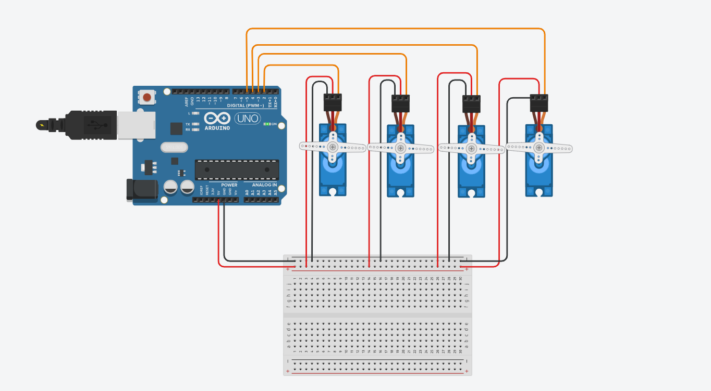

# 🤖 Walking Motion Using Servo Motors

## 🧠 Objective

Develop and simulate an algorithm to control 4 servo motors for simulating a walking motion in a humanoid robot.  
This simulation is implemented using Tinkercad Circuits and Arduino code.

---

## 🛠️ Components Used

- 🔌 **Microcontroller**: Arduino Uno  
- ⚙️ **Servo Motors**: 4   
  - Servo 1: Right Hip  
  - Servo 2: Right Knee  
  - Servo 3: Left Hip  
  - Servo 4: Left Knee  
- 🧪 **Tinkercad Circuits**: For simulation  
- 🔌 Jumper Wires and Breadboard 

---

## 🎞️ Tinkercad Simulation

🔗 **Live Project Link**:  
[👉 View Simulation on Tinkercad](https://www.tinkercad.com/things/3tTA8J9z8wh-servo-motion-control?sharecode=mE1XJTLkogiGkb3NoLZHAGssPu2ac5Fdyl7D9MTRCv8)

This simulation demonstrates:
- A smooth servo sweep from 0° to 180° and back.
- Then holding all servos at a 90° neutral position.

---

## 📋 Algorithm for Walking Simulation

### 1. Initialization:
- Attach all 4 servos to designated Arduino pins.
- Set all servos to 90° to simulate a standing robot.

### 2. Walking Motion (Conceptual):
- **Lift Leg**: Rotate hip servo forward + bend knee.
- **Swing Forward**: Straighten the leg forward.
- **Lower Foot**: Place leg down and balance.
- **Repeat for Opposite Leg**

This motion is emulated with a sweep movement for testing servo ranges.

---

## 💻 Arduino Code

```cpp
#include <Servo.h>

// Create servo objects for each motor
Servo myservo1, myservo2, myservo3, myservo4;

void setup() {
  // Attach servos to pins
  myservo1.attach(2);
  myservo2.attach(3);
  myservo3.attach(4);
  myservo4.attach(5);

  // Perform one sweep: 0 -> 180
  for (int pos = 0; pos <= 180; pos++) {
    moveAllServos(pos);
    delay(15);  // Wait for servo to reach the position
  }

  // Then sweep back: 180 -> 0
  for (int pos = 180; pos >= 0; pos--) {
    moveAllServos(pos);
    delay(15);
  }

  // Hold all servos at 90 degrees
  moveAllServos(90);
}

void loop() {
  // No repeated actions required
}

// Helper function to move all servos to the same position
void moveAllServos(int angle) {
  myservo1.write(angle);
  myservo2.write(angle);
  myservo3.write(angle);
  myservo4.write(angle);
}
```
## 🖼️ Circuit Preview




